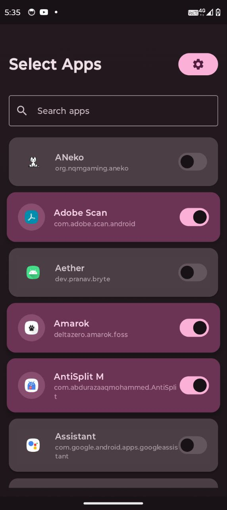
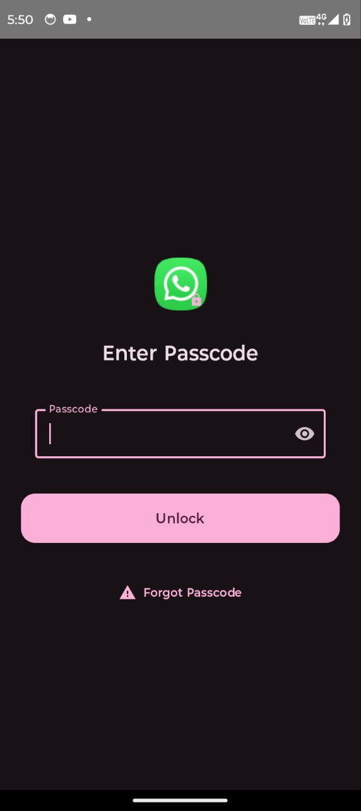
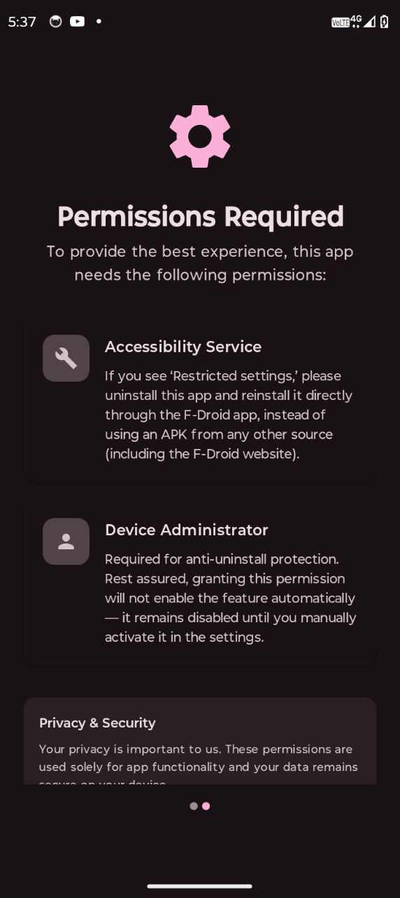
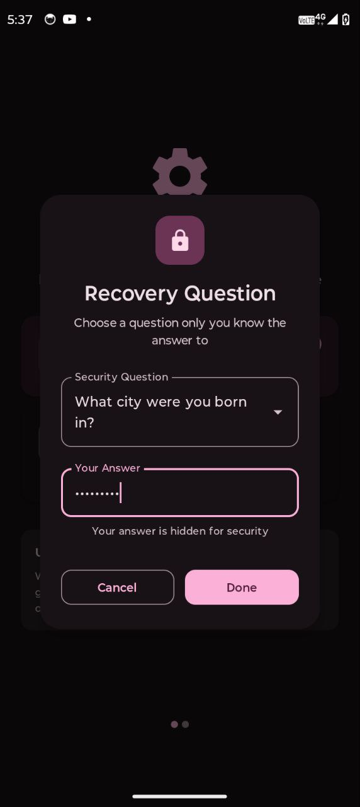

# 🔒 LockLock - Ultimate App Lock with Accessibility & Device Admin

LockLock is a sleek, **Material 3** powered Android app that gives you full control over your apps with advanced locking features — without sacrificing privacy or performance.

---

## Features

* 🚫 **App Locking**
* 🛡️ **Anti-Uninstall Protection**
* 🛠️ **Bruteforce Protection**
* 🔑 **Forgot Password Support**
* 🎨 **Modern, Clean UI**
  Built with **Material 3** design principles for a smooth and intuitive user experience.
* 🔒 **No Internet Required**
  Works 100% offline — your data never leaves your device, so no worries about data theft or privacy leaks.

---

## Screenshots
Click on any image to enlarge it.
<table>
	<tr>
		<td></td>
		<td></td>
		<td></td>
		<td></td>
	</tr>
</table>

---

## How It Works

1. **Accessibility Service Monitoring**
   LockLock uses Android’s Accessibility Services to detect when locked apps are opened and immediately blocks access unless the correct password is entered. This approach allows it to work on virtually any app without requiring root access.

2. **Device Admin for Anti-Uninstall**
   By requesting Device Administrator rights, LockLock prevents unauthorized users from uninstalling the app without your permission, adding an extra layer of security.

3. **Password & Bruteforce Protection**
   LockLock enforces a password lock screen for protected apps, and intelligently blocks repeated incorrect attempts by temporarily locking access, keeping your data safe from hacking attempts.

4. **Offline Privacy**
   Since LockLock does not use the internet at all, your passwords and lock data remain strictly on your device — no servers, no cloud syncing, no data leaks.

---

## Why Choose LockLock?

* No root required
* Strict privacy by design
* Powerful anti-tampering features
* Beautiful, intuitive Material 3 interface
* Lightweight and efficient

---

## Getting Started

1. Install LockLock from a trusted source (fdroid app recommended).
2. Don't use the fdroid website, use the fdroid app instead to skip the hassle of enabling restricted settings.
3. Set your password & security question.
4. Grant Accessibility and Device Admin permissions when prompted.
5. Enjoy peace of mind knowing your apps are secure!
6. Choose the apps you want to lock.

---

## Support & Feedback

Questions, suggestions, or issues? Reach out on \[your contact info or support channel].

---

LockLock — **Your Privacy, Locked Tight.** 🔐

Tags: 

---
